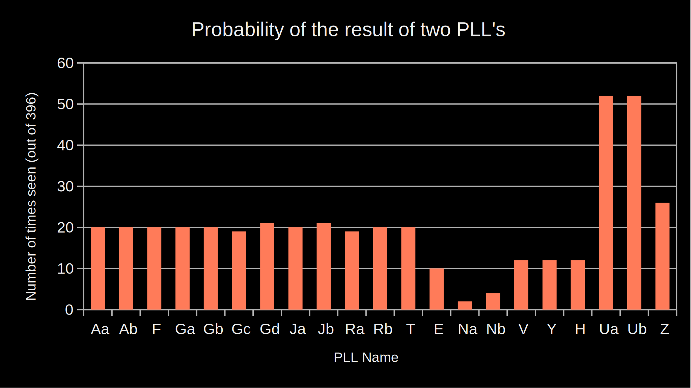

# PLL-Combination-Solver
A python program calculating cubing PLL cases

To run an interactive tool that calculates the resultant PLL from two inputs run:\
```python3 main.py```

To calculate every possible combination of two pll's and output to `data/out.csv` run:\
```python3 all_combinations.py```

The results as a spreadsheet can be found at `results.ods`\
The final results as a bar chart are:


